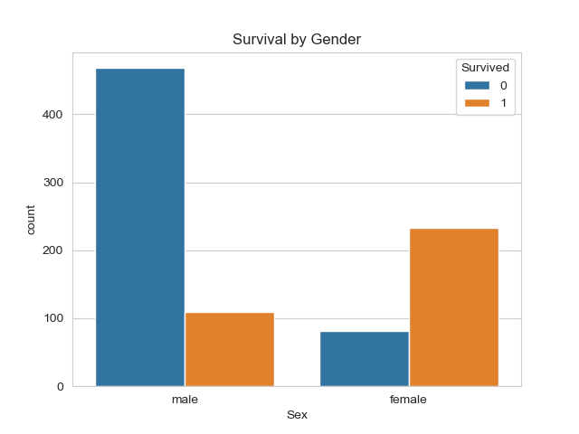
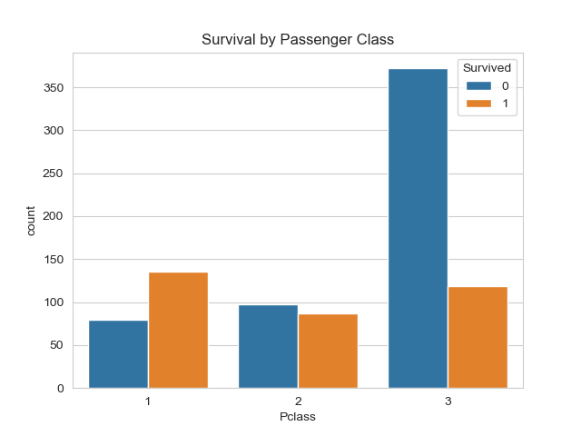
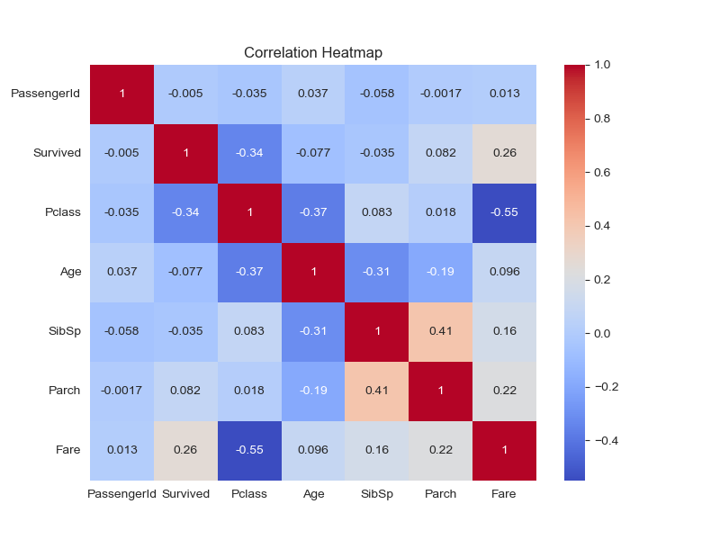
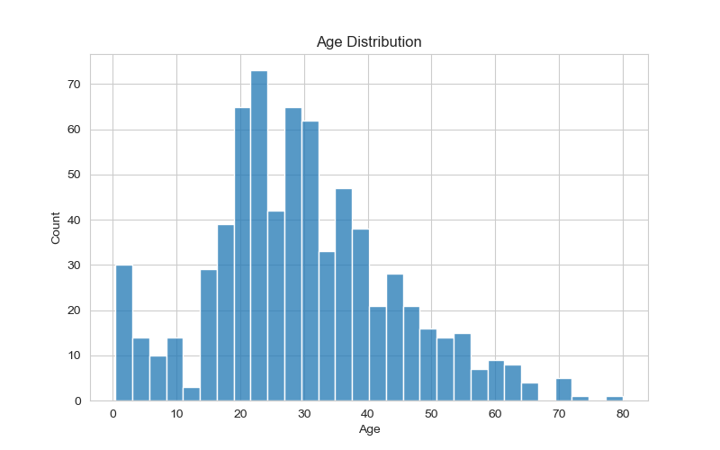

# Titanic Exploratory Data Analysis (EDA)

## Project Overview

This project performs Exploratory Data Analysis (EDA) on the Titanic dataset to identify patterns that influenced passenger survival. The analysis includes data exploration, visualization, correlation analysis, and key insights using Python libraries.

---

## Objective

The main objectives of this project are to:

- Load and explore the Titanic dataset
- Check the dataset shape, data types, and missing values
- Analyze survival rates by gender, passenger class, and age group
- Visualize the distributions of Age, Fare, and Passenger Class
- Create a correlation heatmap for numerical features
- Summarize the important findings from the analysis

---

## Tools and Libraries Used

- Python
- Pandas
- Matplotlib
- Seaborn
- Jupyter Notebook

---

## Dataset

**Dataset:** Titanic Dataset

**File Used:** `titanic.csv`

---

## Project Structure

```
History-1-Titanic-EDA/
│
├── Titanic_EDA.ipynb
├── titanic.csv
├── README.md
└── images/
    ├── survival_gender.png
    ├── survival_class.png
    ├── survival_age_group.png
    ├── age_distribution.png
    ├── fare_distribution.png
    ├── heatmap.png
    └── passenger_class_distribution.png
```

---

## Analysis Performed

- Data Loading
- Dataset Shape
- Data Types
- Missing Value Analysis
- Statistical Summary
- Survival Analysis by Gender
- Survival Analysis by Passenger Class
- Survival Analysis by Age Group
- Correlation Heatmap
- Age Distribution
- Fare Distribution
- Passenger Class Distribution

---

## Key Findings

1. Female passengers had a significantly higher survival rate than male passengers.
2. First-class passengers were more likely to survive than passengers in other classes.
3. Most passengers belonged to the Young Adult age group.
4. Passengers who paid higher fares generally had better survival chances.
5. The Cabin column contained many missing values, while the Age column also had missing data that should be handled before advanced analysis.

---

## How to Run

1. Clone this repository.
2. Install the required libraries:

```bash
pip install pandas matplotlib seaborn notebook
```

3. Open Jupyter Notebook.

```bash
jupyter notebook
```

4. Open `Titanic_EDA.ipynb`.

5. Run all cells in order.

---

## Output

The notebook generates:

- Survival by Gender Chart
- Survival by Passenger Class Chart
- Survival by Age Group Chart
- Age Distribution Histogram
- Fare Distribution Histogram
- Passenger Class Distribution Chart
- Correlation Heatmap

All generated images are saved in the **images** folder.

---

## Visualizations

### Survival by Gender



### Survival by Passenger Class



### Correlation Heatmap



### Age Distribution



---

## Author

**Swetha C**

Business Analytics Intern (VedGrow Internship)
